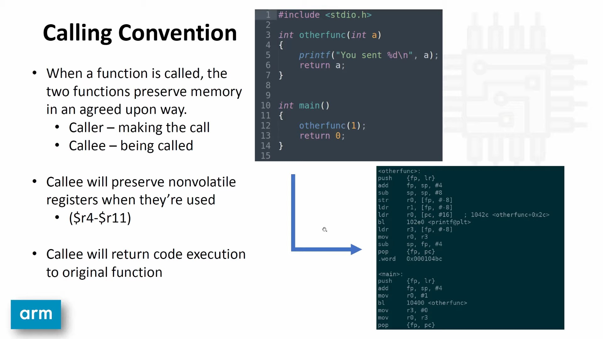

# arm_01
Learn ARM assembly language (with cross compiler).

* [ARM assembly language](https://youtu.be/FV6P5eRmMh8)
* [Emulating ARM with QEMU on Debian/Ubuntu](https://gist.github.com/luk6xff/9f8d2520530a823944355e59343eadc1)
* [ARM System Call Table](https://chromium.googlesource.com/chromiumos/docs/+/master/constants/syscalls.md#arm-32_bit_EABI)
* [THUMB Mode](https://youtu.be/rsg_Krh-o1U)
* [Low Level Learning github](https://github.com/lowlevellearning)

> Google 'arm 32 system call table', then select 'arm (32-bit/EABI)'.
## 1. Installation

```sh
$ uname -p
x86_64
$ uname -a
Linux GEO-WCND1383YRS 5.10.102.1-microsoft-standard-WSL2 #1 SMP Wed Mar 2 00:30:59 UTC 2022 x86_64 x86_64 x86_64 GNU/Linux

$ sudo apt-get -y install gcc-arm*
Reading package lists... Done
Building dependency tree       
Reading state information... Done
Note, selecting 'gcc-arm-none-eabi-source' for glob 'gcc-arm*'
Note, selecting 'gcc-arm-linux-gnueabihf' for glob 'gcc-arm*'
Note, selecting 'gcc-arm-none-eabi' for glob 'gcc-arm*'
Note, selecting 'gcc-arm-linux-gnueabi' for glob 'gcc-arm*'
The following packages were automatically installed and are no longer required:
  bridge-utils python3-cliapp python3-markdown python3-packaging python3-pyparsing python3-ttystatus ubuntu-fan
Use 'sudo apt autoremove' to remove them.
The following additional packages will be installed:
  binutils-arm-linux-gnueabi binutils-arm-linux-gnueabihf binutils-arm-none-eabi cpp-9-arm-linux-gnueabi
  cpp-9-arm-linux-gnueabihf cpp-arm-linux-gnueabi cpp-arm-linux-gnueabihf gcc-10-cross-base
  ...


```

## 2. Compilation
```sh
# Compile to object codes
$ arm-linux-gnueabi-as 001.asm -o 001.o
$ file 001.o
001.o: ELF 32-bit LSB relocatable, ARM, EABI5 version 1 (SYSV), not stripped

# Linker
$ arm-linux-gnueabi-gcc-9 001.o -o 001.elf
/usr/lib/gcc-cross/arm-linux-gnueabi/9/../../../../arm-linux-gnueabi/bin/ld: 001.o: in function `_start':
(.text+0x0): multiple definition of `_start'; /usr/lib/gcc-cross/arm-linux-gnueabi/9/../../../../arm-linux-gnueabi/lib/../lib/crt1.o:(.text+0x0): first defined here
/usr/lib/gcc-cross/arm-linux-gnueabi/9/../../../../arm-linux-gnueabi/bin/ld: /usr/lib/gcc-cross/arm-linux-gnueabi/9/../../../../arm-linux-gnueabi/lib/../lib/crt1.o: in function `_start':
(.text+0x34): undefined reference to `main'
collect2: error: ld returned 1 exit status'

# Issue: automatically linked with libc and the _start was redefined
$ arm-linux-gnueabi-gcc-9 001.o -o 001.elf -nostdlib
$ file 001.elf
001.elf: ELF 32-bit LSB executable, ARM, EABI5 version 1 (SYSV), statically linked, BuildID[sha1]=f87b884f2a0392e29aa93715cd8981bb304866e1, not stripped
```

### Execution
```sh
$ sudo apt-get -y install qemu
$ sudo apt-get install qemu-system-arm
$ sudo apt install qemu-user-static
$ ./001.elf 
qemu: uncaught target signal 4 (Illegal instruction) - core dumped
Illegal instruction

$ arm-linux-gnueabi-as 002.asm -o 002.o
$ arm-linux-gnueabi-gcc-9 002.o -o 002.elf -nostdlib
$ ./002.elf
$ echo $?
13

$ arm-linux-gnueabi-as 003.asm -o 003.o
$ arm-linux-gnueabi-gcc-9 003.o -o 003.elf -nostdlib
$ ./003.elf 
Hello, World
```

### Completed *Hello World* App

<details>
   <summary>Show 004.asm</summary>

```asm
# ARM Assembly Tutorial 001

.global _start
.section .text

# STDIN - 0
# STDOUT - 1
# STDERR - 2

# write a string to stdout

_start:
# NR 4, syscall: write
  mov r7, #0x4
  mov r0, #1        ; # file descriptor (fd=1): STDOUT
  ldr r1, =message  ; # pointer to the buffer
  mov r2, #MSG_LEN  ; # buffer count
  swi 0

# NR 1, syscall: exit
  mov r7, #0x1
  mov r0, #65       ; # return code
  swi 0

.section .data
  message:
  .ascii "Hello, World\n"
  .equ MSG_LEN, . - message

```
</details>

Output:
```sh
$ arm-linux-gnueabi-as 004.asm -o 004.o
$ arm-linux-gnueabi-gcc-9 004.o -o 004.elf -nostdlib
$ ./004.elf 
Hello, World
$ echo $?
65
```

## 3. `THUMB` mode (16-bit instructions instead of 32-bit ones)

## Switch to *thumb mode*

<details>
   <summary>Show 005.asm</summary>

```asm
# ARM Assembly Tutorial 001

.global _start
.section .text

# STDIN - 0
# STDOUT - 1
# STDERR - 2

# write a string to stdout

_start:

hello_world:
  mov r7, #0x4
  mov r0, #1
  ldr r1, =message
  mov r2, #MSG_LEN
  swi 0

.thumb
hello_world_thumb:
  mov r7, #0x4
  mov r0, #1
  ldr r1, =message
  mov r2, #MSG_LEN
  swi 0

exit:
  mov r7, #0x1
  mov r0, #65
  swi 0

.section .data
  message:
  .ascii "Hello, World\n"
  .equ MSG_LEN, . - message
```
</details>

Output:
```sh
$ arm-linux-gnueabi-as 005.asm -o 005.o
$ arm-linux-gnueabi-objdump -d 005.o

005.o:     file format elf32-littlearm


Disassembly of section .text:

00000000 <_start>:
   0:   e3a07004        mov     r7, #4
   4:   e3a00001        mov     r0, #1
   8:   e59f1014        ldr     r1, [pc, #20]   ; 24 <exit+0x6>
   c:   e3a0200d        mov     r2, #13
  10:   ef000000        svc     0x00000000

00000014 <hello_world_thumb>:
  14:   2704            movs    r7, #4
  16:   2001            movs    r0, #1
  18:   4902            ldr     r1, [pc, #8]    ; (24 <exit+0x6>)
  1a:   220d            movs    r2, #13
  1c:   df00            svc     0

0000001e <exit>:
  1e:   2701            movs    r7, #1
  20:   2041            movs    r0, #65 ; 0x41
  22:   df00            svc     0
  24:   00000000        .word   0x00000000

# <hello_world_thumb> is in THUMB mode (16-bit instructions)

# Note the <exit> section is still in THUMB mode
# We need to fix this:
```

## Switch back to *arm mode* to exit

<details>
   <summary>Show 005.asm</summary>

```asm
# ARM Assembly Tutorial 001

.global _start
.section .text

# STDIN - 0
# STDOUT - 1
# STDERR - 2

# write a string to stdout

_start:

hello_world:
  mov r7, #0x4
  mov r0, #1
  ldr r1, =message
  mov r2, #MSG_LEN
  swi 0

.thumb
hello_world_thumb:
  mov r7, #0x4
  mov r0, #1
  ldr r1, =message
  mov r2, #MSG_LEN
  swi 0

.arm
exit:
  mov r7, #0x1
  mov r0, #65
  swi 0

.section .data
  message:
  .ascii "Hello, World\n"
  .equ MSG_LEN, . - message
```
</details>

Output:
```sh

$ arm-linux-gnueabi-gcc-9 005.o -o 005.elf -nostdlib -static
$ ./005.elf 
Hello, World

# However, the 'Hello, World' was only printed once
```

## We also need to branch to *thumb mode* by add 1 to the label

<details>
   <summary>Show 005.asm</summary>

```asm
# ARM Assembly Tutorial 001

.global _start
.section .text

# STDIN - 0
# STDOUT - 1
# STDERR - 2

# write a string to stdout

_start:

hello_world:
  mov r7, #0x4
  mov r0, #1
  ldr r1, =message
  mov r2, #MSG_LEN
  swi 0

# add 1 to the label
# branch to it
  ldr r0, =#hello_world_thumb
  add r0, r0, #1
  bx r0

.thumb
hello_world_thumb:
  mov r7, #0x4
  mov r0, #1
  ldr r1, =message
  mov r2, #MSG_LEN
  swi 0

.arm
exit:
  mov r7, #0x1
  mov r0, #65
  swi 0

.section .data
  message:
  .ascii "Hello, World\n"
  .equ MSG_LEN, . - message
```
</details>

Output:
```sh

$ arm-linux-gnueabi-as 005.asm -o 005.o
$ arm-linux-gnueabi-gcc-9 005.o -o 005.elf -nostdlib -static
$ ./005.elf 
Hello, World
Hello, World
qemu: uncaught target signal 11 (Segmentation fault) - core dumped
Segmentation fault

# We got Segmentation fault error

$ arm-linux-gnueabi-objdump -d 005.o

005.o:     file format elf32-littlearm


Disassembly of section .text:

00000000 <_start>:
   0:   e3a07004        mov     r7, #4
   4:   e3a00001        mov     r0, #1
   8:   e59f1028        ldr     r1, [pc, #40]   ; 38 <exit+0xc>
   c:   e3a0200d        mov     r2, #13
  10:   ef000000        svc     0x00000000
  14:   e59f0020        ldr     r0, [pc, #32]   ; 3c <exit+0x10>
  18:   e2800001        add     r0, r0, #1
  1c:   e12fff10        bx      r0

00000020 <hello_world_thumb>:
  20:   2704            movs    r7, #4
  22:   2001            movs    r0, #1
  24:   4904            ldr     r1, [pc, #16]   ; (38 <exit+0xc>)
  26:   220d            movs    r2, #13
  28:   df00            svc     0
        ...

0000002c <exit>:
  2c:   e3a07001        mov     r7, #1
  30:   e3a00041        mov     r0, #65 ; 0x41
  34:   ef000000        svc     0x00000000
  38:   00000000        .word   0x00000000
  3c:   00000020        .word   0x00000020

```

## We also need to branch to `exit` in order to get back to *arm mode*

<details>
   <summary>Show 005.asm</summary>

```asm
# ARM Assembly Tutorial 001

.global _start
.section .text

# STDIN - 0
# STDOUT - 1
# STDERR - 2

# write a string to stdout

_start:

hello_world:
  mov r7, #0x4
  mov r0, #1
  ldr r1, =message
  mov r2, #MSG_LEN
  swi 0

# add 1 to the label
# branch to it
  ldr r0, =#hello_world_thumb
  add r0, r0, #1
  bx r0

.thumb
hello_world_thumb:
  mov r7, #0x4
  mov r0, #1
  ldr r1, =message
  mov r2, #MSG_LEN
  swi 0

# branch to exit to return to arm mode
  ldr r0, =#exit
  bx r0

.arm
exit:
  mov r7, #0x1
  mov r0, #65
  swi 0

.section .data
  message:
  .ascii "Hello, World\n"
  .equ MSG_LEN, . - message
```
</details>

Output:
```sh
$ arm-linux-gnueabi-as 005.asm -o 005.o
$ arm-linux-gnueabi-gcc-9 005.o -o 005.elf -nostdlib -static
$ ./005.elf 
Hello, World
Hello, World
$ arm-linux-gnueabi-objdump -d 005.o

005.o:     file format elf32-littlearm


Disassembly of section .text:

00000000 <_start>:
   0:   e3a07004        mov     r7, #4
   4:   e3a00001        mov     r0, #1
   8:   e59f102c        ldr     r1, [pc, #44]   ; 3c <exit+0xc>
   c:   e3a0200d        mov     r2, #13
  10:   ef000000        svc     0x00000000
  14:   e59f0024        ldr     r0, [pc, #36]   ; 40 <exit+0x10>
  18:   e2800001        add     r0, r0, #1
  1c:   e12fff10        bx      r0

00000020 <hello_world_thumb>:
  20:   2704            movs    r7, #4
  22:   2001            movs    r0, #1
  24:   4905            ldr     r1, [pc, #20]   ; (3c <exit+0xc>)
  26:   220d            movs    r2, #13
  28:   df00            svc     0
  2a:   4806            ldr     r0, [pc, #24]   ; (44 <exit+0x14>)
  2c:   4700            bx      r0
        ...

00000030 <exit>:
  30:   e3a07001        mov     r7, #1
  34:   e3a00041        mov     r0, #65 ; 0x41
  38:   ef000000        svc     0x00000000
  3c:   00000000        .word   0x00000000
  40:   00000020        .word   0x00000020
  44:   00000030        .word   0x00000030
```

## 4. Make a function call by using the stack
In ARM, frame pointer (fp) is *r11* and stack pointer (sp) is *r13*.

* [Getting Started with ARM Stacks](https://youtu.be/7fezHk7nmzY)



<details>
   <summary>Show stack.asm</summary>

```asm
# ARM Stacks

.global _start
.section .text

_start:
  bl hello_world        ; # branch and link
  bl exit               ; # to do a function call

hello_world:
  push {r4-r11, lr}     ; # Preserve all non-volatile registers
                        ; # Preserve lr (line #8)
  mov fp, sp
  sub sp, sp, #0x40      ; # Add 64 bytes memory to work with

# load a value to r1, then store it in a memory location
  ldr r1, =#0x1337
  str r1, [fp, #-0x10]

  mov r7, #0x4
  mov r0, #1
  ldr r1, =message
  mov r2, #MSG_LEN
  swi 0

  mov sp, fp            ; # set stack pointer back
  pop {r4-r11, pc}      ; # set link register (lr) to program counter (pc)
                        ; # in order to return code control to the caller

exit:
  push {fp, lr}         ; # we don't use r4-r11 registers
  
  mov r7, #0x1
  mov r0, #65
  swi 0

  pop {fp, pc}          ; return

.section .data
  message:
  .ascii "Hello, World\n"
  .equ MSG_LEN, . - message
```
</details>

Output:
```sh
$ arm-linux-gnueabi-as stack.asm -o stack.o
$ arm-linux-gnueabi-gcc-9 stack.o -o stack.elf -nostdlib -static
$ ./stack.elf 
Hello, World

$ arm-linux-gnueabi-objdump -d stack.o

stack.o:     file format elf32-littlearm


Disassembly of section .text:

00000000 <_start>:
   0:   eb000000        bl      8 <hello_world>
   4:   eb00000b        bl      38 <exit>

00000008 <hello_world>:
   8:   e92d4ff0        push    {r4, r5, r6, r7, r8, r9, sl, fp, lr}
   c:   e1a0b00d        mov     fp, sp
  10:   e24dd040        sub     sp, sp, #64     ; 0x40
  14:   e59f1030        ldr     r1, [pc, #48]   ; 4c <exit+0x14>
  18:   e50b1010        str     r1, [fp, #-16]
  1c:   e3a07004        mov     r7, #4
  20:   e3a00001        mov     r0, #1
  24:   e59f1024        ldr     r1, [pc, #36]   ; 50 <exit+0x18>
  28:   e3a0200d        mov     r2, #13
  2c:   ef000000        svc     0x00000000
  30:   e1a0d00b        mov     sp, fp
  34:   e8bd8ff0        pop     {r4, r5, r6, r7, r8, r9, sl, fp, pc}

00000038 <exit>:
  38:   e92d4800        push    {fp, lr}
  3c:   e3a07001        mov     r7, #1
  40:   e3a00041        mov     r0, #65 ; 0x41
  44:   ef000000        svc     0x00000000
  48:   e8bd8800        pop     {fp, pc}
  4c:   00001337        .word   0x00001337
  50:   00000000        .word   0x00000000
```

## 5. Mixing `c` and `asm`
The toolchain thas has *hf* (hardware FPU) in it means the processor has Floating Point Unit.

* [do arm processors float?](https://youtu.be/MnMUH_mzfOw)

```sh
$ arm-linux-gnueabihf-gcc -static -o calc float.s calc.c 
$ ./calc
2.898000
$ python3 
Python 3.8.10 (default, Jun  2 2021, 10:49:15) 
[GCC 9.4.0] on linux
Type "help", "copyright", "credits" or "license" for more information.
>>> 4.20*.69
2.8979999999999997
>>> 
```

## Linux System Call Table
arm (32-bit/EABI)
Compiled from Linux 4.14.0 headers.

|NR	|syscall name	|references	|%r7	|arg0 (%r0)	|arg1 (%r1)	|arg2 (%r2)	|arg3 (%r3)	|arg4 (%r4)	|arg5 (%r5)|
| :--: | :--: | :--: | :--: | :--: | :--: | :--: | :--: | :--: | :--: |
|0	|restart_syscall	|man/ cs/	|0x00|	-|	-|	-|	-|	-|	-|
|1	|exit	|man/ cs/	|0x01|	int error_code|	-|	-|	-|	-|	-|
|2	|fork	|man/ cs/	|0x02|	-|	-|	-|	-|	-|	-|
|3	|read	|man/ cs/	|0x03|	unsigned int fd	|char *buf	|size_t count|	-|	-|	-|
|4	|write	|man/ cs/	|0x04|	unsigned int fd	|const char *buf	|size_t count|